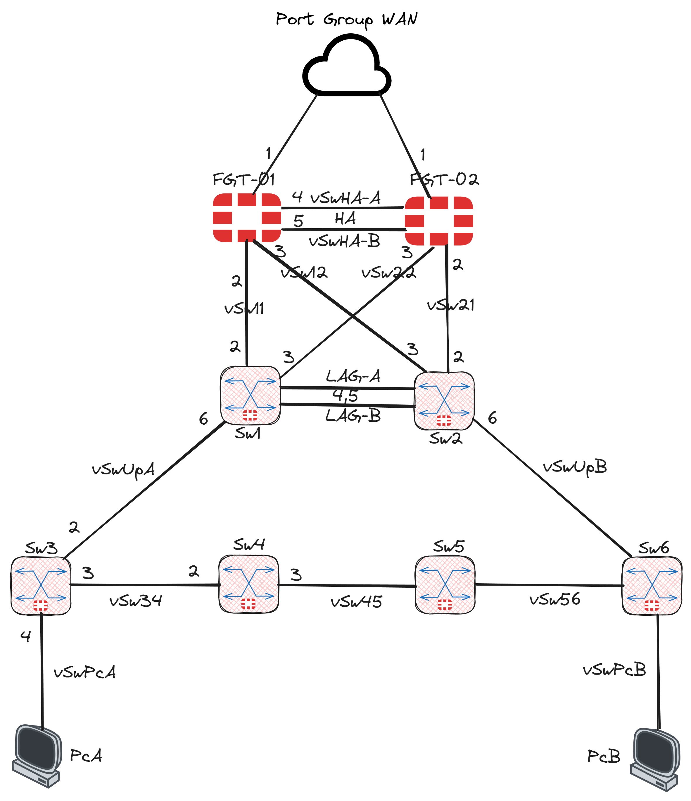

Fortinet FG-VM & Virtual Switch Sample Topology

This repo targets a local vSphere based deployment setup, using Terraform's [HCL-vshpere][1] provider. 
End goal is to deploy the below topology:

Pending work: licensing the virtual switches, building the FortiLink / MCLAG related config on the Gates.

You need to add your own terraform.tfvars containing values for sensitive variables and local paths (such as fg-ovf, sw-ovf) to OVF files for both FG & SW images. 
For this to work, your also need:
1) A vCenter VM deployed on your local ESXi
2) An ISO image created for auto-licensing your Gates upon first boot (Fortinet DOCs: "cloud-init using config drive"). Licensing the switches is still pending. 

[1]: https://github.com/hashicorp/terraform-provider-vsphere            "HCL-vshpere"